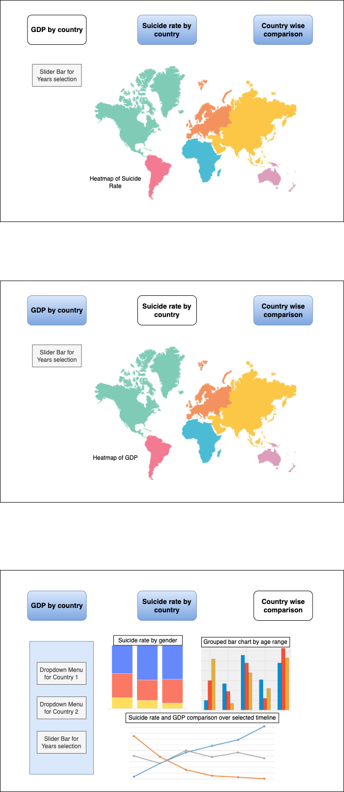

# suicide_indicator_r

This Shiny app is based on World Health Organizaton's suicide data, and can help a user analyse suicides around the world based on various socio-economic factors related to the geographic location of the events. Mental health researchers and service providers are the most important class of target audience for this app. A user would be able to see how suicide rates, along with the socio-economic factors, evolve over time in different regions of the world. The app also offers country wise comparisons of the factors that revolve around deaths classified as suicides.

The design of the dashboard is set up with three main options or tabs. The first two present animated (over time) maps showing evolution of suicide numbers (tab 1) and country wise GDP (tab 2) in the world. This would hopefully enable the user to see any trends and correlations (if any) between the two factors. On both these tabs, a slider bar will be given to the user for customized selection of the timeline for animation. The third tab is aimed at presenting three more visual representations for country wise comparison of data. Two dropdown menus will be provided on the left panel to select the two countries to compare, and a slider bar to select timeline. On the right, we will present a stacked bar chart comparing suicide numbers segregated gender wise for both countries and an overall world average. The second visual will be a grouped bar chart comparing suicides among various age groups for the two countries, along with a world average for comparison. The third and final visual for this tab will be a line chart for the GDP as well as suicide rate per capita for the two countries. 

Here is the prototype for our planned dashboard.

## Authors

- Qurat-ul-Ain Azim
- Stepan Zaiatc
- Ty Andrews
- Zilong Yi

## Contributing

Interested in contributing? Check out the contributing guidelines. Please note that this project is released with a Code of Conduct. By contributing to this project, you agree to abide by its terms.

## License 

`suicide_indicator_r` was created by Qurat-ul-Ain Azim, Stepan Zaiatc, Ty Andrews and Zilong Yi. The materials of this project are licensed under the [MIT license](https://github.com/UBC-MDS/suicide_indicator_r/blob/main/LICENSE). If re-using/re-mixing please provide attribution and link to this webpage.